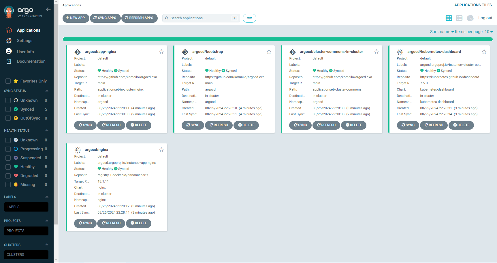

In my previous post we started the local Kubernetes cluster using K3s. Now we want to add ArgoCD to perform GitOps based deployments on the Kubernetes cluster.

## Why ArgoCD?

ArgoCD is a powerful tool for adopting GitOps practices in managing Kubernetes applications. It ensures consistency, reliability, and automation by synchronizing the state of your applications with the state defined in your Git repositories.

- **Seamless GitOps Integration**: ArgoCD integrates natively with Git, Helm, and Kustomize, making it easy to manage and deploy applications directly from your source code repositories.
- **Enhanced Security and Compliance**: With strong security features, ArgoCD helps enforce compliance by controlling who has access to deploy and manage applications.
- **Visual Interface**: ArgoCD's intuitive UI allows you to monitor the state of your applications and manage deployments visually, reducing the need for complex command-line operations.

Adding ArgoCD to your local Kubernetes cluster is a logical next step before configuring additional components or deploying more applications. It lays a solid foundation for GitOps-driven application management and automation.

## Creating a GitHub App

Setting up a GitHub App provides a more secure and controlled method of accessing your repositories compared to exposing SSH keys. By using a GitHub App, you can limit access to specific repositories, providing finer-grained permissions for the ArgoCD instance. This method also eliminates the need for managing SSH keys, making it simpler and more secure.

While creating a GitHub App is not mandatory to get ArgoCD up and running, this guide assumes you have already set one up or plan to use it for future configurations.

> **Note**: If you haven’t created a GitHub App yet, refer to [GitHub’s official documentation](https://docs.github.com/en/developers/apps/building-github-apps) for step-by-step instructions.

## Creating a Manifest Git Repository

You will need a repository to store the manifests that ArgoCD will manage. For this guide, we use an example repository called [argocd-example-manifests](https://github.com/komailo/argocd-example-manifests). This repository contains manifests to set up an ApplicationSet template, as well as some basic applications like Kubernetes Dashboard and NGINX.

You can either fork this repository or clone it to use as a base. Once forked or cloned, push it to your own private or public repository.

Recommendation: If you decide to fork the repository or use your own repository, remember to update the repository URL in any manifest files you use later, especially in the `values.yaml` and `application-bootstrap.yaml` file, to point to your own repository.

## Installing ArgoCD via Helm

We will use [Helm charts for ArgoCD](https://github.com/argoproj/argo-helm/tree/main/charts/argo-cd) to install it on the cluster with our custom values file.

**Add the Argo Helm Repository**
The first step is to add the Argo Helm repository to your setup. This repository contains the Helm charts necessary for installing ArgoCD. The command for adding the repository is:

```sh
helm repo add argo https://argoproj.github.io/argo-helm
```

**Create the values.yaml File**
After adding the Helm repository, create a `values.yaml` file to customize the ArgoCD installation. This file includes configuration settings like exposing ArgoCD with an external IP address, setting up GitHub App credentials, and defining repository connections. Here's what you need to configure in this file:

- Server Configuration: Setting the service type to LoadBalancer ensures ArgoCD can be accessed externally by assigning an external IP address.
- Namespace Management: You can allow ArgoCD to manage applications across all namespaces by setting application.namespaces: "\*".
- Credential Templates: Configure a credential template that can be reused across multiple repositories. It should include your GitHub App ID, installation ID, and private key.
- Repositories: Define the repository that contains your ArgoCD manifests. Update the repository URL to reflect your own repository or use the example manifests repository thats in the example below.

```yaml
# values.yaml
---
server:
  service:
    type: LoadBalancer # this adds the external IP to ArgoCD so it is accessible

configs:
  params:
    # https://argo-cd.readthedocs.io/en/stable/operator-manual/app-any-namespace/
    application.namespaces: "*"

  credentialTemplates:
    # The credential template allows reusing the credentials accross multiple repository connections
    # the credential is automatically used when the prefix url matches the repository.
    argocd-github-app:
      url: https://github.com
      githubAppID: "app id"
      githubAppInstallationID: "installation id"
      githubAppPrivateKey: |
        ...insert the private key of the GitHub app
  repositories:
    my-argocd-manifests:
      # this is the repository with ArgoCD Manifests. Update it if you are using your own repository.
      url: https://github.com/komailo/argocd-example-manifests
```

**Install ArgoCD Using Helm**
Once the values.yaml file is ready, you can install ArgoCD on your Kubernetes cluster using Helm. Ensure you specify the namespace (e.g., argocd) where ArgoCD will be deployed. The command to run is:

```sh
helm install argocd argo/argo-cd --namespace argocd -f values.yaml
```

This step will install ArgoCD in your cluster using the custom configuration provided in the values.yaml file. Before you attempt to login lets complete the boostrap process in the next section.

## Bootstrapping ArgoCD

The bootstrap process involves deploying an initial application via a manifest. This application will act as the base setup for ArgoCD, and subsequent applications will be managed and deployed in a GitOps fashion via your manifest repository.

**Update the Repo URL**: If you are using your own repository instead of the example manifest repo update the `repoURL` field to reflect the URL of your own repository, whether it's the forked argocd-example-manifests or your custom repository.

Create the following manifest file `application-bootstrap.yaml` and apply it via `kubectl apply --filename bootstrap-application.yaml`

```yaml
# application-bootstrap.yaml
---
apiVersion: argoproj.io/v1alpha1
kind: Application
metadata:
  name: bootstrap
  namespace: argocd
spec:
  project: default
  source:
    # update this URL if you forked the repository or are using your own repository
    repoURL: "https://github.com/komailo/argocd-example-manifests"
    targetRevision: main
    path: "argocd"
  destination:
    server: "https://kubernetes.default.svc"
    namespace: "argocd"
  syncPolicy:
    automated:
      prune: true
      selfHeal: true
```

## Accessing ArgoCD

After ArgoCD has been installed, you need to access its UI or CLI to manage your applications. To do this, you’ll need the external IP address of the ArgoCD server.

**Getting the IP Address**
Run the following command to get the external IP address of the ArgoCD server:

```sh
kubectl get svc argocd-server --namespace argocd
```

The output will show details about the argocd-server service, including the external IP address:

```sh
$ kubectl get svc argocd-server --namespace argocd
NAME            TYPE           CLUSTER-IP       EXTERNAL-IP   PORT(S)                      AGE
argocd-server   LoadBalancer   172.17.169.190   10.1.2.210   80:31047/TCP,443:31213/TCP   19h
```

**Getting the admin password**
Before you can log in to the ArgoCD UI or CLI, you need the default admin password. This password is stored as a Kubernetes secret in your cluster.

Command to Retrieve Admin Password:

```sh
echo "Admin password: $(kubectl ---namespace argocd get secret argocd-initial-admin-secret --output jsonpath='{.data.password}' | base64 --decode)"
```

Once you have the IP address, head to the ArgoCD UI via the browser and login with username admin and the password you retrieved above.

After logging in, you should see the ArgoCD dashboard displaying any pre-configured applications from the example repository (if you used one).
These applications, such as Kubernetes Dashboard or NGINX, will already be set up in the ArgoCD UI for monitoring and management.



**Tip:** Make sure to explore the UI to familiarize yourself with its features, such as application synchronization, rollback options, and monitoring capabilities.

## Conclusion

With ArgoCD successfully installed and configured on your local Kubernetes cluster, you now have a powerful GitOps tool to manage and automate your application deployments. We started by creating a GitHub App to securely connect to your repositories without exposing SSH keys, then used Helm to install ArgoCD with a custom configuration tailored to your environment. We also bootstrapped ArgoCD by deploying an initial application that serves as the foundation for managing future deployments. Finally, we accessed the ArgoCD UI, where you can now monitor, manage, and synchronize your applications directly from your Git repository.

By following these steps, you’ve set up a scalable and automated system for continuous delivery within your Kubernetes cluster, leveraging the full power of GitOps. This is just the beginning—moving forward, you can continue to build on this setup by adding more applications, configuring additional security measures, and fine-tuning ArgoCD to suit your development workflow.

Stay tuned to this series as we continue to explore more advanced Kubernetes topics, including application deployments, secret management, local volume management, and tunneling via Cloudflared.
