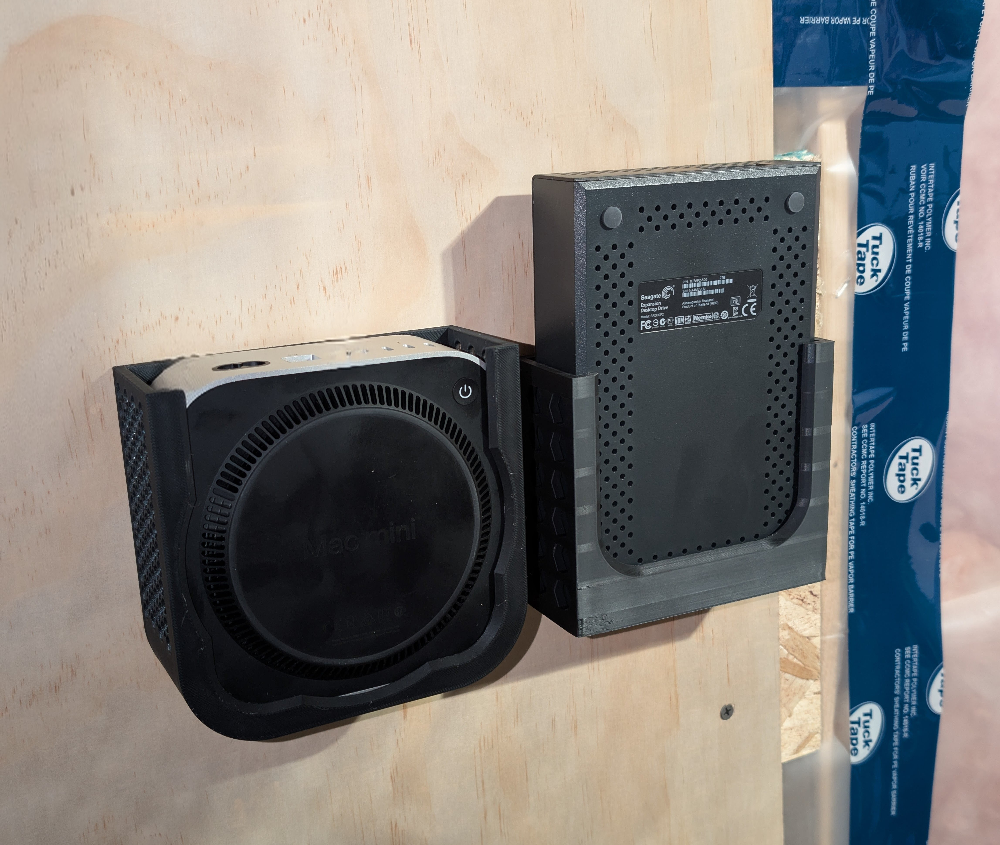
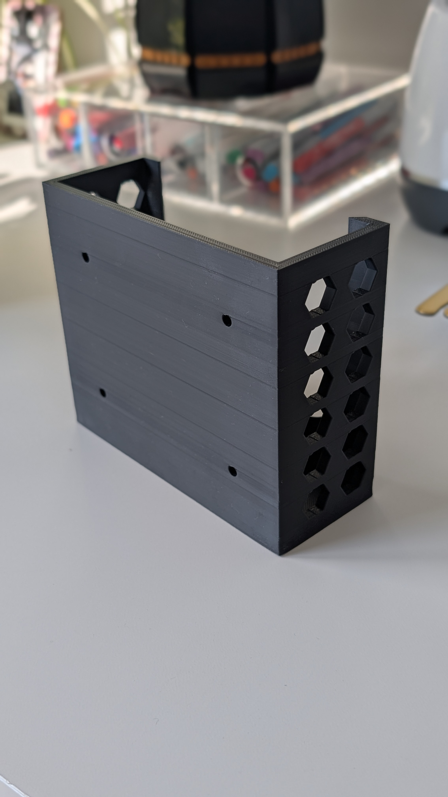
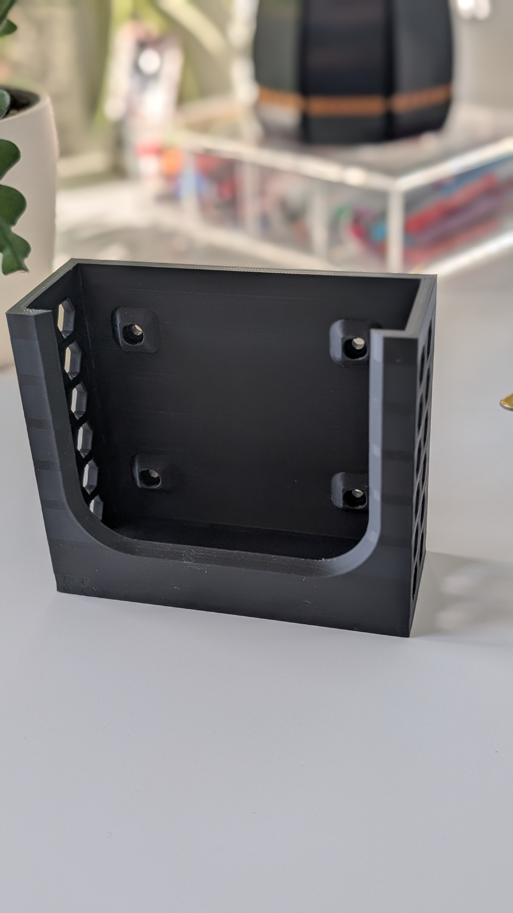
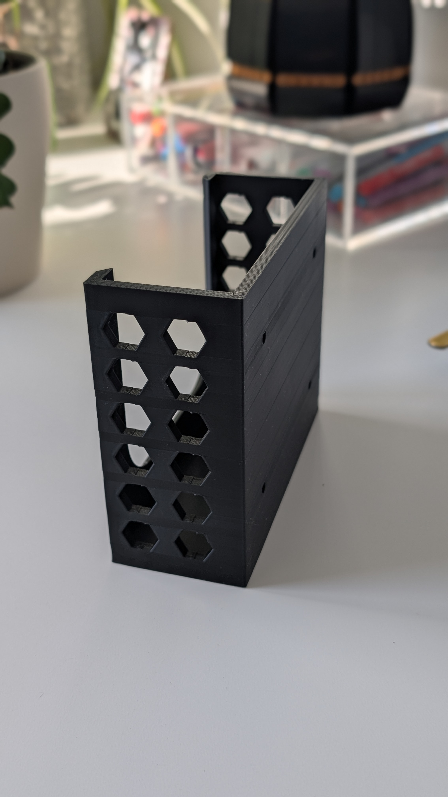
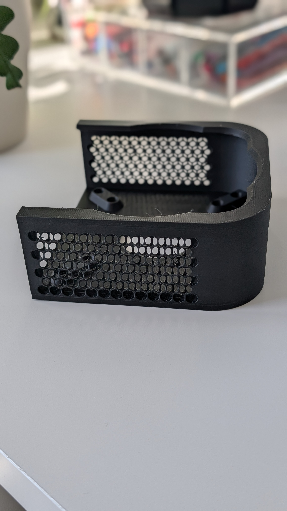
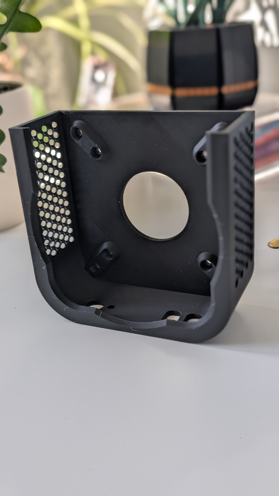

I recently added an M4 Mac mini to my homelab. Since Mac minis aren’t meant to be mounted—and additional storage is typically external—this post covers how I wall-mounted both the computer and the external drive for a tidy, cable-managed setup.


This post is about **wall mounting** Mac mini and an external drive. If you want a **server rack** solution, this isn’t it.


## Printer & filament

- **Printer:** Bambu P1S with a textured PEI plate
- **Filament:** iBoss PLA+ (Black Matte, ±0.02 mm)

The P1S defaults worked fine. I’ll capture exact slicer settings next time, but if you need a starting point: 0.2 mm layer height, 4–5 walls, 20–30% grid infill, 60 °C bed, and enable part cooling after the first few layers to combat warping.

## Mac mini (M4) mount

I used this community model: [Mac mini M4 VESA mount](https://www.thingiverse.com/thing:6827444) on Thingiverse.

**Orientation & cooling notes**

- I initially printed **back-side down** and had to clean a lot of supports.
- For better surface finish and **layer-line strength in the load direction**, I prefer printing **front-face down** so the downward force sits “with” the lines rather than across them.
- I reduced early-layer fan to minimize warp, then ramped to moderate cooling after layer 3–5.

## External drive mount

I designed a simple bracket sized for my external drive (≈119 mm long, ~36 mm thick; **measure your exact width**).

Design choices:

- A snug U-channel with a tiny clearance to avoid rattling.
- A lip at the bottom to carry the weight and a strap slot (optional) for security.
- Chamfers/fillets on edges to reduce stress risers and print cleanup.

I didn’t need VESA holes since I’m mounting to a plywood backer.

[Link](https://www.thingiverse.com/thing:7125378) to the stl files.

## Hardware & install

- **Screws:** #8 × 3/4" pan-head (worked for both mounts; the drive bracket is tight with #8 but works fine when you use an impact drive).
- **Backer:** 12–18 mm plywood anchored into studs.
- **Tip:** Pre-plan cable paths and leave room to snake power/Thunderbolt without removing the mounts.

## Lessons learned / future improvements

- Both designs require **vertical clearance** above the unit to lift the Mac mini/drive out. Plan spacing between shelves/gear accordingly.
- Next iteration: a **two-piece design**—a wall plate plus a slide-in cradle—or a **hook-and-latch** to allow front removal with minimal overhead clearance.

## Photos

